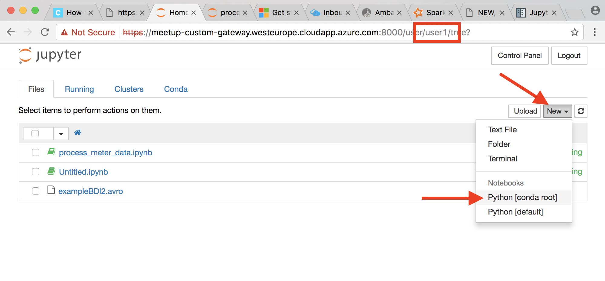
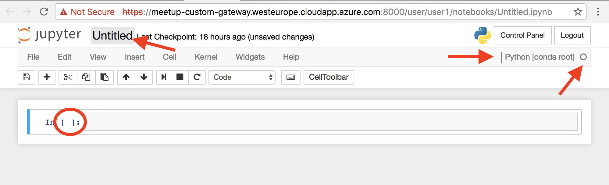
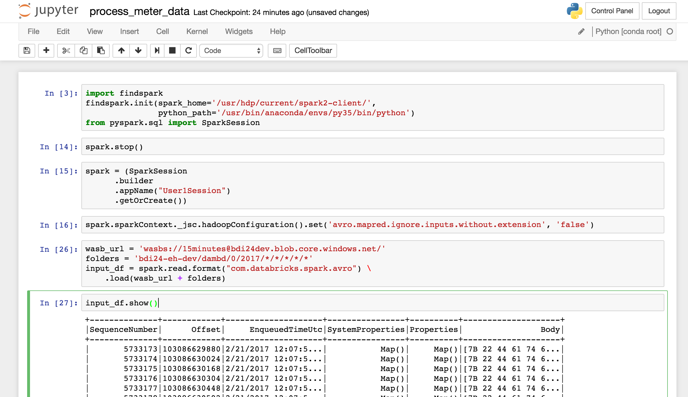

# Process data with Spark

## Preparation

We have prepared this lab by setting up a HDInsigh-cluster. This is an Hortonworks distribution of Hadoop in the Azure-cloud.

The cluster exists of 2 master and a couple of worker-nodes. The CPU and memory of the workers will be shared trough YARN (YetAnotherResourceNegotiator). Later in this lab we will be able to view the resource consumption of the sessions on the cluster.

When you start a Spark-session on the cluster you will claim some of there resources.


More information about HDinsight & spark on the Microsoft website: [hdinsight-apache-spark-overview](https://docs.microsoft.com/en-us/azure/hdinsight/hdinsight-apache-spark-overview)


## Jupyter - interactive notebook

For this lab we will be using an interactive notebook in the webbrowser to explore your generated data. 

### Goal
Goal of this lab is to show the possibilities of Jupyter to code interactivly and touch the open-source world of Hadoop.

### Out of the box
HDinsigh comes with a Jupyter-notebook which has nice examples and getting started guides, but is only accessible with the master username / password. This exposed at https://[CLUSTERNAME].azurehdinsight.net/jupyter). Not suiteable for multiple users.

If you want to try it for yourself feel you can follow the Azure Microsoft tutorial: [hdinsight-apache-spark-jupyter-spark-sql](https://docs.microsoft.com/en-us/azure/hdinsight/hdinsight-apache-spark-jupyter-spark-sql)

### Prepared for you

For this lab we have created a extra gateway node to work with multiple users on Jupyter (using [JupyterHub](https://jupyterhub.readthedocs.io/en/latest/)). This instance does not have all the nice features of the MS-Jupyter notebook, but is good enough for this lab.

You can access a personal Jupyter instance per user:

https://meetup-custom-gateway.westeurope.cloudapp.azure.com:8000/user/[username]

You can login with a predefined password.

### Create a new Notebook

- First we need to create an new notebook:



You should give your notebook a meaningfull name and save it. You can see which kernel you are using. The Python 3.5 kernel is installed and managed by Conda in our case [conda root]. You can install many kernels; for Scala, R, Python2/3, PySpark and other languages. 

On the HDInsight-cluster there are some more kernels prepared. We have prepared only this kernel which is suiteable for Spark coded in Python.

When the kernel is working you will see the white-circle being black. And the cell has an astrix [*] on the left.
 


### Access data with HDFS

You can execute shell (OS-commands) when prefix with **!**[command] 

You can interact with HDFS-api to access your storage account. For this to work you need to add you credentials in the Hadoop configuration on the system.

- storage-account: pn123dev
- container: meetup

Use the HDFS command to see if your user folder is created and contains some data files.

```shell
!hdfs dfs -ls wasbs://[CONTAINER]@[STORAGEACCOUNT].blob.core.windows.net/

container_url='wasbs://.....windows.net/'
user='YourUserFolder'
folder='dambd/*/2017/02/*/*/'

# recursive list all files, print only first items:
!hdfs dfs -ls -R -h $container_url/$user/$folder | head -n10

# Look at the content of a single file, the first 1000 characters:
!hdfs dfs -cat wasbs://..... | head -c 1000
```

First bytes show its Avro, with the schema. The rest is serialized data. More info about [AVRO](https://avro.apache.org/docs/current/). Lets see how 'big' our dataset is:

```
!hdfs dfs -du -h $container_url/$user
```

Depending on the dataset and expected joins with other sets you might need to tune the cluster and container size. Today we have set a single container with 3 cpu's and 5Gb memory.

With the `hdfs` command there are other file operations we can do, checkt the docs: [hdfs command](http://hadoop.apache.org/docs/r2.7.0/hadoop-project-dist/hadoop-common/FileSystemShell.html).  Today we are not going to tranfer files from external storage-account onto the HDinsight storage account.

We want to load all the (avro) data in your user folder and process it with Spark.


### Start a Spark Session

We will code in python and import findspark.
docs: [SparkSession](http://spark.apache.org/docs/latest/api/python/pyspark.sql.html#pyspark.sql.SparkSession)

```python
import findspark
findspark.init(spark_home='/usr/hdp/current/spark2-client/',
               python_path='/usr/bin/anaconda/envs/py35/bin/python')

import os
from pyspark.sql import SparkSession

spark = (
    SparkSession
    .builder
#   .config('customproperty', 'customvalue')
    .appName(os.environ['USER'])
    .getOrCreate()
)

spark.version
```

If you are done you might stop your session to not use too many resources on the cluster 
```python
spark.stop()
```
Now that you have a spark-session you will claim memory and CPU power from the cluster. You can view this at the YARN-resource manager. Check your load on the cluster: [YARN-resource manager](https://pn1234-hdi-dev.azurehdinsight.net/yarnui/hn/cluster/scheduler). At the YARN resource manager you can click on you application to view the logs and SparkUI. In this lab we will not go into these details.

Because the filenames do not and on filename._avro_ we need to set a specific hadoop option to allow these files created by the datafactory to be picked up:

```python
hadoop_conf = spark.sparkContext._jsc.hadoopConfiguration()
hadoop_conf.set('avro.mapred.ignore.inputs.without.extension', 'false')
```

We are able to load our data is a Spark DataFrame (in memory | column oriented data scructure) docs: [spark-avro](https://github.com/databricks/spark-avro#python-api)

```python
input_sdf = (
    spark.read.format("com.databricks.spark.avro")
    .load(container_url + os.sep + user + os.sep + folder)
)

input_sdf.show(n=5)
input_sdf.count()
```
The count() function wil actually load all the data and count all the rows available.

You might have some data in your DataFrame, like me:



The headers are present, but we have to convert the Body, because it looks like a byte-array. We store this in a new DataFrame called `meter_data_df`. This was a bit of a challange and there might be better ways, but we managed to transform the Boty field into a usefull DataFrame. Docs: [spark.functions](http://spark.apache.org/docs/latest/api/python/pyspark.sql.html#module-pyspark.sql.functions) 

```python
from pyspark.sql import functions as F

meter_sdf = (
    input_sdf
    .withColumn("Body", F.col("Body").astype('string'))
    .withColumn("Datetime", F.get_json_object('Body',"$.Date").astype('timestamp'))
    .withColumn("ElectricityUsage", F.get_json_object('Body', '$.ElectricityUsage').astype('integer'))
    .withColumn("CustomerId", F.get_json_object('Body', '$.CustomerId'))
    .drop("Body")
)
```

We can store these intermediate results in memory. When reusing this DataFrame you will benefit from this cache. docs: [persist](http://spark.apache.org/docs/latest/api/python/pyspark.sql.html#pyspark.sql.DataFrame.persist) 

```python
meter_sdf.persist()
meter_sdf.show(n=5)
meter_sdf.count()
```

Lets calculate an average per hour. We transform the `meter_sdf` into `avg_per_date_hour_sdf`. Note that this tranformation is **lazy**, so the calculation is not executed, because we are not calling a spark action like show(), collect(), etc.

```python
def to_date_hour(col):
    return F.from_unixtime(F.round(F.unix_timestamp(col) / 3600) * 3600)

avg_per_date_hour_sdf = (
    meter_sdf
    .withColumn('DateHour', to_date_hour(F.col('DateTime')))
    .groupBy('DateHour')
    .agg(F.mean('ElectricityUsage').alias("AvgElectricityUsage"))
    .sort('DateHour')
)
```
Now lets plot this DataFrame 

```python
def plot_sdf(sdf, x, y):
    sdf.toPandas().plot(x=x, y=y, rot=90, figsize=(18, 8))

# Enable inline plotting of charts
%matplotlib inline

plot_sdf(avg_per_date_hour_sdf, x='DateHour', y='AvgElectricityUsage')
```
#### Spark SQL to query your data

The last part of this lab is the sql abstaction. With spark you can register your DataFrame as a table and query with SQL.

Here is an example query to show the count, min, max, average of the datapoints per day:

```python
meter_sdf.registerTempTable('meter_data')

spark.sql("""
select
    CustomerId,
    date(DateTime) as date,
    count(ElectricityUsage) as cnt,
    min(ElectricityUsage) as min,
    max(ElectricityUsage) as max,
    avg(ElectricityUsage) as avg
from
    meter_data
group by 
    date(DateTime),
    CustomerId
""").show()
```
## End

If you want, you can view a fully working notebook in the solutions folder on git.


